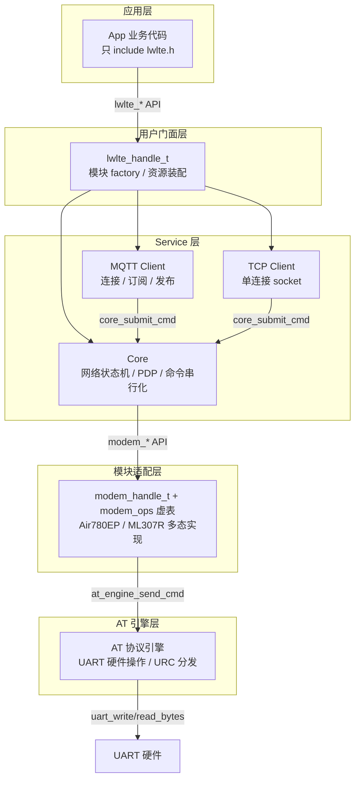

# esp-lwlte

> 一个 ESP-IDF LTE 通信组件库，用 C 面向对象设计封装 LTE 模块的 AT 命令通信，让 ESP32 应用以简洁的异步 API 完成 4G 联网、MQTT、TCP、HTTP 通信。


## 项目简介

esp-lwlte 是一个自研的 ESP-IDF 组件库，封装了与 LTE 模块的 AT 命令通信逻辑。当前以 ESP32-C3 作为主机 MCU，适配上海合宙 Air780EP 和中移物联网 ML307R 两款 LTE 模块，并计划支持更多模块变体。

**设计哲学：直接建在 ESP-IDF 上。** 不封装 FreeRTOS / UART / GPIO，所有层直接使用 ESP-IDF API——这与 Espressif 官方组件（esp-mqtt、button、esp-sr）的设计哲学一致。通过分层架构 + `modem_ops_t` 虚函数表实现多态，换模块只需新增一个 modem 子类和门面 factory，上层代码零改动。

> **当前状态：开发中。** 已完成核心网络保活、MQTT、TCP / TCP-TLS、Ping、HTTP / HTTPS、SSL 配置等能力，尚未发布正式版本。

### 能力矩阵

| 能力 | 状态 | 说明 |
|------|------|------|
| 核心网络保活 / PDP / 自动重连 | ✅ 已完成 | 网络状态机、PDP 激活、断线重连 |
| MQTT 客户端 | ✅ 已完成 | 连接 / 订阅 / 发布，支持 TLS |
| TCP 客户端 | ✅ 已完成 | 单连接，支持 plain TCP / TCP-TLS |
| SSL/TLS 配置 | ✅ 已完成 | CA / 客户端证书，多 context 管理 |
| Ping 诊断 | ✅ 已完成 | 同步阻塞式网络连通性诊断 |
| HTTP/HTTPS | ✅ 已完成 | 同步请求 / 响应，GET / POST |
| 低功耗 / 休眠管理 | 🔲 规划中 | P1 优先级 |
| UDP / 多连接 | 🔲 规划中 | P2 优先级 |

---

## 架构设计

esp-lwlte 采用**用户门面 + 内部分层服务架构**。业务 App 代码只通过 `lwlte_handle_t` 和 `lwlte_*` 用户 API 操作 LTE，内部各层单向依赖、各司其职。



**核心设计原则：**

1. **直接建在 ESP-IDF 上** —— 不封装 FreeRTOS / UART / GPIO，所有层直接使用 ESP-IDF API，与 Espressif 官方组件设计哲学一致
2. **模块差异集中在适配层** —— 通过 `modem_ops_t` 虚函数表实现多态，换模块只需新增一个 modem 子类 + 门面 factory，上层零改动
3. **单向依赖，层间只调紧邻下一层** —— 运行期 service 代码不跨层调用，事件 / URC 通过队列 + 回调逐层上传

---

## 代码工程

### C 面向对象设计

项目在纯 C 中实践 OOP，不依赖 C++ 编译器：

| OOP 概念 | 实现方式 |
|----------|---------|
| **封装** | opaque 句柄（`typedef struct lwlte_t *lwlte_handle_t`），struct 定义在 `.c` 中不公开 |
| **继承** | struct 嵌套（子类第一个字段为基类），`container_of` 宏实现向上转型 |
| **多态** | `static const modem_ops_t` 虚函数表，包装 API 内部 `me->ops->method()` 转发 |
| **资源装配** | 门面 factory 作为 composition root，唯一认识全部装配 API |

### 代码审查

每个模块完成后走标准化审查流程（`docs/agents/review-checklist.md`），覆盖：

- 线程安全 / 并发边界
- 资源泄漏 / 错误路径清理
- ISR 安全 / 实时性约束
- API 契约一致性

从 [提交历史](https://github.com/ZhouDreams/esp-lwlte/commits) 可以看到每个模块的审查与修复记录。

### 文档体系

`docs/agents/` 下维护 12 份设计与规范文档，覆盖架构、类设计、编码规范、OOP 指南、错误处理、AT 命令参考、代码审查清单等。这些文档既是开发规范，也是 AI 编码助手的结构化上下文。

---

## AI 辅助开发

这个项目全程使用 AI 辅助开发。以下是工具链和工作方法论。

### 工具链

| 工具 | 角色 |
|------|------|
| [opencode](https://opencode.ai) | AI 编码 CLI，交互式开发与代码编辑 |
| [superpowers](https://github.com/obra/superpowers) | 技能插件，提供 brainstorm → spec → plan → code → review 工作流 |
| GLM / Claude 等 LLM | 代码生成、架构推理、代码审查 |

### 开发工作流

每个功能模块都走完整的结构化流程，而非简单的"让 AI 写代码"：

```
需求理解 → 头脑风暴 (brainstorming)
         → 设计文档 (spec)
         → 实现计划 (writing-plans)
         → 逐步实现 (executing-plans)
         → 代码审查 (requesting-code-review)
         → 验证完成 (verification-before-completion)
```

先 brainstorm 理清需求和设计，产出 spec 文档；再基于 spec 写实现计划；按计划逐步实现并验证；最后用代码审查清单做质量把关。

### AI 上下文工程

让 AI 高效参与项目的关键，是提供结构化的上下文：

- **`AGENTS.md` / `AGENTS_ZH.md`**：AI 编码助手的入口索引，指向所有设计文档
- **`docs/agents/` 文档体系**：12 份文档覆盖架构、类设计、编码规范、AT 命令参考等，作为 AI 的结构化上下文
- **代码审查清单**：标准化质量检查，确保 AI 生成的代码满足嵌入式工程的线程安全、资源管理等硬约束

### 实际成果

通过 AI 辅助开发，这个项目从零搭建了完整的分层架构、两种 LTE 模块适配、6 项已落地通信能力，并保持高质量的代码审查和文档体系。

---

## 硬件接线

测试环境为单块 ESP32-C3 同时连接两个 LTE 模块，通过编译宏选择运行哪一个：

| ESP32-C3 | Air780EP | ML307R | 说明 |
|----------|----------|--------|------|
| GPIO0 | RX | — | UART1 TX → Air780EP |
| GPIO1 | TX | — | UART1 RX ← Air780EP |
| GPIO2 | EN | — | Air780EP 使能控制 |
| GPIO3 | — | RX | UART1 TX → ML307R |
| GPIO10 | — | TX | UART1 RX ← ML307R |
| GPIO4 | — | EN | ML307R 使能控制 |

---

## 示例速览

最小联网示例（Air780EP）：

```c
#include "lwlte.h"

// 1. 配置并初始化 Air780EP 门面
lwlte_air780ep_config_t config = {
    .base = {
        .uart    = { .num = UART_NUM_1, .tx_pin = 0, .rx_pin = 1, .baud_rate = 115200 },
        .modem   = { .en_pin = 2 },
        .core    = { .apn = "cmnet", .primary_cid = 1 },
    },
};
lwlte_handle_t lte;
lwlte_air780ep_init(&config, &lte);

// 2. 注册事件 → 异步启动 → 等待 NET_ONLINE
esp_event_handler_register(LWLTE_EVENT, ESP_EVENT_ANY_ID, handler, NULL);
lwlte_start(lte);  // ESP_OK 仅表示请求已提交
```

仓库内置 6 个示例，通过 `example/main.c` 的 `EXAMPLE_SELECTED` 宏选择：

| 示例 | 说明 |
|------|------|
| `EXAMPLE_AIR780EP_BASIC_CONNECT` | Air780EP 最小联网 + Ping + HTTP |
| `EXAMPLE_AIR780EP_MQTT_CLIENT` | Air780EP ThingsBoard MQTT 发布 / 订阅 |
| `EXAMPLE_AIR780EP_TCP_CLIENT` | Air780EP TCP echo（可选 TLS） |
| `EXAMPLE_ML307R_BASIC_CONNECT` | ML307R 最小联网 + Ping + HTTP |
| `EXAMPLE_ML307R_MQTT_CLIENT` | ML307R ThingsBoard MQTT 发布 / 订阅 |
| `EXAMPLE_ML307R_TCP_CLIENT` | ML307R TCP echo（可选 TLS） |

---

## Roadmap

- 🔲 低功耗 / 休眠管理（PSM / 浅睡 / 深睡）
- 🔲 UDP 与多连接 socket
- 🔲 更多 LTE 模块适配
- 🔲 SMS 短信收发（待评估）

---

## License

[MIT](LICENSE)
