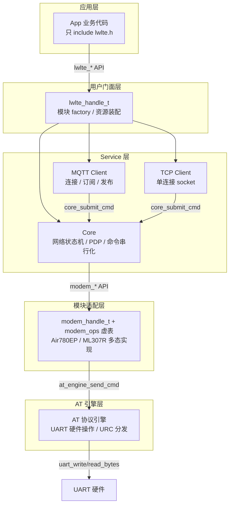

# GitHub 中文 README 实现计划

> **For agentic workers:** REQUIRED SUB-SKILL: Use superpowers:subagent-driven-development (recommended) or superpowers:executing-plans to implement this plan task-by-task. Steps use checkbox (`- [ ]`) syntax for tracking.

**Goal:** 创建 GitHub 仓库根目录的中文 README.md 和 MIT LICENSE 文件，作为作品集展示用途

**Architecture:** 两个独立文件——README.md（中文，5 大段落）和 LICENSE（标准 MIT 文本）。README 按 spec 设计的方案 B 结构组织：开头+能力矩阵 → 架构设计 → 代码工程 → AI 辅助开发 → 硬件+示例+Roadmap

**Tech Stack:** Markdown / Mermaid / shields.io badges

**Spec:** `docs/superpowers/specs/2026-07-11-readme-github-design.md`

---

## File Structure

| 文件 | 操作 | 职责 |
|------|------|------|
| `LICENSE` | 新建 | MIT License 标准文本 |
| `README.md` | 新建 | 中文 README，仓库根目录 |

---

### Task 1: 创建 LICENSE 文件

**Files:**
- Create: `LICENSE`

- [ ] **Step 1: 创建 MIT LICENSE 文件**

写入以下完整内容（copyright holder 为 JovisDreams，与 git 作者名和代码 `@author` 一致）：

```
MIT License

Copyright (c) 2026 JovisDreams

Permission is hereby granted, free of charge, to any person obtaining a copy
of this software and associated documentation files (the "Software"), to deal
in the Software without restriction, including without limitation the rights
to use, copy, modify, merge, publish, distribute, sublicense, and/or sell
copies of the Software, and to permit persons to whom the Software is
furnished to do so, subject to the following conditions:

The above copyright notice and this permission notice shall be included in all
copies or substantial portions of the Software.

THE SOFTWARE IS PROVIDED "AS IS", WITHOUT WARRANTY OF ANY KIND, EXPRESS OR
IMPLIED, INCLUDING BUT NOT LIMITED TO THE WARRANTIES OF MERCHANTABILITY,
FITNESS FOR A PARTICULAR PURPOSE AND NONINFRINGEMENT. IN NO EVENT SHALL THE
AUTHORS OR COPYRIGHT HOLDERS BE LIABLE FOR ANY CLAIM, DAMAGES OR OTHER
LIABILITY, WHETHER IN AN ACTION OF CONTRACT, TORT OR OTHERWISE, ARISING FROM,
OUT OF OR IN CONNECTION WITH THE SOFTWARE OR THE USE OR OTHER DEALINGS IN THE
SOFTWARE.
```

- [ ] **Step 2: 验证文件已创建**

运行：`ls -la LICENSE`
预期：文件存在，大小约 1KB

---

### Task 2: 创建 README.md

**Files:**
- Create: `README.md`

这是主交付物。按 spec 的方案 B 结构，一次写入完整内容。

- [ ] **Step 1: 写入 README.md 完整内容**

写入以下完整 Markdown 内容。内容来自 spec 的 5 段设计，已翻译为最终 Markdown 格式：

````markdown
# esp-lwlte

> 一个 ESP-IDF LTE 通信组件库，用 C 面向对象设计封装 LTE 模块的 AT 命令通信，让 ESP32 应用以简洁的异步 API 完成 4G 联网、MQTT、TCP、HTTP 通信。


## 项目简介

esp-lwlte 是一个自研的 ESP-IDF 组件库，封装了与 LTE 模块的 AT 命令通信逻辑。当前以 ESP32-C3 作为主机 MCU，适配上海合宙 Air780EP 和中移物联网 ML307R 两款 LTE 模块，并计划支持更多模块变体。

**设计哲学：直接建在 ESP-IDF 上。** 不封装 FreeRTOS / UART / GPIO，所有层直接使用 ESP-IDF API——这与 Espressif 官方组件（esp-mqtt、button、esp-sr）的设计哲学一致。通过分层架构 + `modem_ops_t` 虚函数表实现多态，换模块只需新增一个 modem 子类和门面 factory，上层代码零改动。

> **当前状态：开发中。** 已完成核心网络保活、MQTT、TCP / TCP-TLS、Ping、HTTP / HTTPS、SSL 配置等能力，尚未发布正式版本。

### 能力矩阵

| 能力 | 状态 | 说明 |
|------|------|------|
| 核心网络保活 / PDP / 自动重连 | ✅ 已完成 | 网络状态机、PDP 激活、断线重连 |
| MQTT 客户端 | ✅ 已完成 | 连接 / 订阅 / 发布，支持 TLS |
| TCP 客户端 | ✅ 已完成 | 单连接，支持 plain TCP / TCP-TLS |
| SSL/TLS 配置 | ✅ 已完成 | CA / 客户端证书，多 context 管理 |
| Ping 诊断 | ✅ 已完成 | 同步阻塞式网络连通性诊断 |
| HTTP/HTTPS | ✅ 已完成 | 同步请求 / 响应，GET / POST |
| 低功耗 / 休眠管理 | 🔲 规划中 | P1 优先级 |
| UDP / 多连接 | 🔲 规划中 | P2 优先级 |

---

## 架构设计

esp-lwlte 采用**用户门面 + 内部分层服务架构**。业务 App 代码只通过 `lwlte_handle_t` 和 `lwlte_*` 用户 API 操作 LTE，内部各层单向依赖、各司其职。



**核心设计原则：**

1. **直接建在 ESP-IDF 上** —— 不封装 FreeRTOS / UART / GPIO，所有层直接使用 ESP-IDF API，与 Espressif 官方组件设计哲学一致
2. **模块差异集中在适配层** —— 通过 `modem_ops_t` 虚函数表实现多态，换模块只需新增一个 modem 子类 + 门面 factory，上层零改动
3. **单向依赖，层间只调紧邻下一层** —— 运行期 service 代码不跨层调用，事件 / URC 通过队列 + 回调逐层上传

---

## 代码工程

### C 面向对象设计

项目在纯 C 中实践 OOP，不依赖 C++ 编译器：

| OOP 概念 | 实现方式 |
|----------|---------|
| **封装** | opaque 句柄（`typedef struct lwlte_t *lwlte_handle_t`），struct 定义在 `.c` 中不公开 |
| **继承** | struct 嵌套（子类第一个字段为基类），`container_of` 宏实现向上转型 |
| **多态** | `static const modem_ops_t` 虚函数表，包装 API 内部 `me->ops->method()` 转发 |
| **资源装配** | 门面 factory 作为 composition root，唯一认识全部装配 API |

### 代码审查

每个模块完成后走标准化审查流程（`docs/agents/review-checklist.md`），覆盖：

- 线程安全 / 并发边界
- 资源泄漏 / 错误路径清理
- ISR 安全 / 实时性约束
- API 契约一致性

从 [提交历史](https://github.com/ZhouDreams/esp-lwlte/commits) 可以看到每个模块的审查与修复记录。

### 文档体系

`docs/agents/` 下维护 12 份设计与规范文档，覆盖架构、类设计、编码规范、OOP 指南、错误处理、AT 命令参考、代码审查清单等。这些文档既是开发规范，也是 AI 编码助手的结构化上下文。

---

## AI 辅助开发

这个项目全程使用 AI 辅助开发。以下是工具链和工作方法论。

### 工具链

| 工具 | 角色 |
|------|------|
| [opencode](https://opencode.ai) | AI 编码 CLI，交互式开发与代码编辑 |
| [superpowers](https://github.com/obra/superpowers) | 技能插件，提供 brainstorm → spec → plan → code → review 工作流 |
| GLM / Claude 等 LLM | 代码生成、架构推理、代码审查 |

### 开发工作流

每个功能模块都走完整的结构化流程，而非简单的"让 AI 写代码"：

```
需求理解 → 头脑风暴 (brainstorming)
         → 设计文档 (spec)
         → 实现计划 (writing-plans)
         → 逐步实现 (executing-plans)
         → 代码审查 (requesting-code-review)
         → 验证完成 (verification-before-completion)
```

先 brainstorm 理清需求和设计，产出 spec 文档；再基于 spec 写实现计划；按计划逐步实现并验证；最后用代码审查清单做质量把关。

### AI 上下文工程

让 AI 高效参与项目的关键，是提供结构化的上下文：

- **`AGENTS.md` / `AGENTS_ZH.md`**：AI 编码助手的入口索引，指向所有设计文档
- **`docs/agents/` 文档体系**：12 份文档覆盖架构、类设计、编码规范、AT 命令参考等，作为 AI 的结构化上下文
- **代码审查清单**：标准化质量检查，确保 AI 生成的代码满足嵌入式工程的线程安全、资源管理等硬约束

### 实际成果

通过 AI 辅助开发，这个项目从零搭建了完整的分层架构、两种 LTE 模块适配、6 项已落地通信能力，并保持高质量的代码审查和文档体系。

---

## 硬件接线

测试环境为单块 ESP32-C3 同时连接两个 LTE 模块，通过编译宏选择运行哪一个：

| ESP32-C3 | Air780EP | ML307R | 说明 |
|----------|----------|--------|------|
| GPIO0 | RX | — | UART1 TX → Air780EP |
| GPIO1 | TX | — | UART1 RX ← Air780EP |
| GPIO2 | EN | — | Air780EP 使能控制 |
| GPIO3 | — | RX | UART1 TX → ML307R |
| GPIO10 | — | TX | UART1 RX ← ML307R |
| GPIO4 | — | EN | ML307R 使能控制 |

---

## 示例速览

最小联网示例（Air780EP）：

```c
#include "lwlte.h"

// 1. 配置并初始化 Air780EP 门面
lwlte_air780ep_config_t config = {
    .base = {
        .uart    = { .num = UART_NUM_1, .tx_pin = 0, .rx_pin = 1, .baud_rate = 115200 },
        .modem   = { .en_pin = 2 },
        .core    = { .apn = "cmnet", .primary_cid = 1 },
    },
};
lwlte_handle_t lte;
lwlte_air780ep_init(&config, &lte);

// 2. 注册事件 → 异步启动 → 等待 NET_ONLINE
esp_event_handler_register(LWLTE_EVENT, ESP_EVENT_ANY_ID, handler, NULL);
lwlte_start(lte);  // ESP_OK 仅表示请求已提交
```

仓库内置 6 个示例，通过 `example/main.c` 的 `EXAMPLE_SELECTED` 宏选择：

| 示例 | 说明 |
|------|------|
| `EXAMPLE_AIR780EP_BASIC_CONNECT` | Air780EP 最小联网 + Ping + HTTP |
| `EXAMPLE_AIR780EP_MQTT_CLIENT` | Air780EP ThingsBoard MQTT 发布 / 订阅 |
| `EXAMPLE_AIR780EP_TCP_CLIENT` | Air780EP TCP echo（可选 TLS） |
| `EXAMPLE_ML307R_BASIC_CONNECT` | ML307R 最小联网 + Ping + HTTP |
| `EXAMPLE_ML307R_MQTT_CLIENT` | ML307R ThingsBoard MQTT 发布 / 订阅 |
| `EXAMPLE_ML307R_TCP_CLIENT` | ML307R TCP echo（可选 TLS） |

---

## Roadmap

- 🔲 低功耗 / 休眠管理（PSM / 浅睡 / 深睡）
- 🔲 UDP 与多连接 socket
- 🔲 更多 LTE 模块适配
- 🔲 SMS 短信收发（待评估）

---

## License

[MIT](LICENSE)
````

- [ ] **Step 2: 验证 README.md 结构完整性**

运行：`grep -c "^## " README.md`
预期：`7`（项目简介、架构设计、代码工程、AI 辅助开发、硬件接线、示例速览、Roadmap、License 共 7 个二级标题）

运行：`grep -c "mermaid" README.md`
预期：`2`（一对 mermaid 代码块标记）

运行：`grep -c "^|" README.md`
预期：大于 `20`（多个表格的行）

---

### Task 3: 最终审查与提交

- [ ] **Step 1: 通读 README.md 全文检查**

逐项检查以下内容：
- [ ] 6 个 badges 图片链接格式正确（`` 语法）
- [ ] 能力矩阵包含 8 行（6 个已完成 + 2 个规划中）
- [ ] Mermaid 图包含 6 个节点（App、FAC、CORE、MQTT、TCP、MOD、AT、HW）和正确的依赖箭头
- [ ] C OOP 表格包含 4 行（封装、继承、多态、资源装配）
- [ ] AI 辅助开发章节包含 4 个小节（工具链、开发工作流、AI 上下文工程、实际成果）
- [ ] 硬件接线表包含 6 行 GPIO 映射
- [ ] 示例列表包含 6 个示例
- [ ] Roadmap 包含 4 项规划
- [ ] License 链接指向 `LICENSE` 文件
- [ ] 无 TODO / TBD / 占位符

- [ ] **Step 2: 检查与仓库实际状态一致**

运行以下命令验证 README 中的关键事实：

```bash
# 验证 GitHub 用户名
git remote get-url origin
# 预期包含：ZhouDreams/esp-lwlte

# 验证文档数量（应接近 12 份）
ls docs/agents/*.md | wc -l

# 验证示例数量
ls example/*.c | grep -v "main\|example_event\|example\.h" | wc -l
# 预期：6
```

- [ ] **Step 3: 提交（需用户确认）**

```bash
git add README.md LICENSE
git commit -m "docs: add Chinese README and MIT License"
```

**注意：提交前必须获得用户明确授权。**
````

---

## Self-Review

### Spec coverage

| Spec 要求 | 对应 Task | 状态 |
|-----------|----------|------|
| 标题 + 一句话简介 | Task 2 Step 1 | ✅ |
| Badges (ESP-IDF v6.0, C, ESP32-C3, MIT, 开发中) | Task 2 Step 1 | ✅ |
| 项目简介 3 段 | Task 2 Step 1 | ✅ |
| 能力矩阵表格 | Task 2 Step 1 | ✅ |
| 架构设计 + Mermaid 图 | Task 2 Step 1 | ✅ |
| 设计哲学 3 条 | Task 2 Step 1 | ✅ |
| C OOP 设计表格 | Task 2 Step 1 | ✅ |
| 代码审查流程 | Task 2 Step 1 | ✅ |
| 文档体系 | Task 2 Step 1 | ✅ |
| AI 工具链表格 | Task 2 Step 1 | ✅ |
| AI 开发工作流 | Task 2 Step 1 | ✅ |
| AI 上下文工程 | Task 2 Step 1 | ✅ |
| AI 实际成果 | Task 2 Step 1 | ✅ |
| 硬件接线表格 | Task 2 Step 1 | ✅ |
| 示例代码 + 列表 | Task 2 Step 1 | ✅ |
| Roadmap | Task 2 Step 1 | ✅ |
| MIT License | Task 1 + Task 2 Step 1 | ✅ |

### Placeholder scan

无 TODO / TBD / "implement later" / "add appropriate" 等占位符。所有内容均为最终 Markdown 文本。

### Type consistency

- GitHub 用户名统一使用 `ZhouDreams`（与 `git remote` 一致）
- 作者名统一使用 `JovisDreams`（与 git 作者和代码 `@author` 一致）
- ESP-IDF 版本统一为 v6.0（与构建环境一致）
- 示例宏名与 `example/README.md` 一致
- GPIO 引脚号与 `docs/agents/build-and-debug.md` 一致
