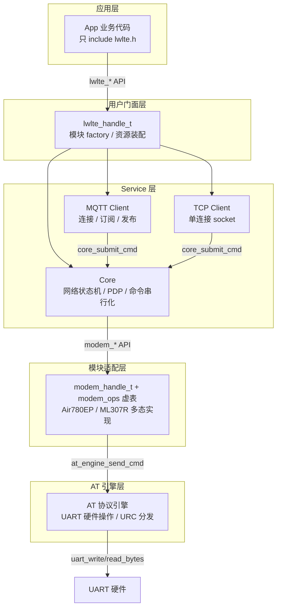

# README 设计文档

## 背景

esp-lwlte 项目需要一个放在 GitHub 仓库根目录的中文 README，主要用途是**作品集 / 展示性质**。作者正在寻找嵌入式 AI 开发方向的工作（如嘉立创嵌入式 AI 开发项目招聘），该类岗位明确要求 AI 辅助开发经验。因此 README 除了展示项目本身，还需独立章节展示 AI 辅助开发能力。

## 设计决策

| 维度 | 决策 | 理由 |
|------|------|------|
| 语言 | 纯中文（代码/类型名/技术术语保留英文） | 用户明确要求中文 README |
| 风格 | 工程能力展示型（方案 B） | 作品集目的，需要展示架构深度 + 工程素养 + AI 开发能力 |
| 项目状态 | 标注"开发中" | 尚未发布版本，如实标注 |
| AI 开发展示 | 独立章节 | 对标招聘要求，展示工作流 + 工具链 + 方法论 |
| 架构图 | Mermaid 分层架构图 | 视觉锚点，一眼理解项目结构 |
| License | MIT | 最宽松，适合作品集展示 |

## 产出文件

| 文件 | 说明 |
|------|------|
| `README.md` | 中文 README，放在仓库根目录，覆盖现有文件 |
| `LICENSE` | MIT License 文件 |

## README 结构设计

### 第 1 段：开头部分（标题 + 简介 + 能力矩阵）

**标题与一句话简介**：

```
# esp-lwlte

> 一个 ESP-IDF LTE 通信组件库，用 C 面向对象设计封装 LTE 模块的 AT 命令通信，
> 让 ESP32 应用以简洁的异步 API 完成 4G 联网、MQTT、TCP、HTTP 通信。
```

**Badges**（在标题下方）：
- ESP-IDF v6.0
- 语言 C
- 目标 ESP32-C3
- License: MIT
- 状态: 开发中

**项目简介**（3 段）：
- 第 1 段：是什么——ESP-IDF 组件库，封装 Air780EP / ML307R 等 LTE 模块的 AT 命令通信，目标主机 ESP32-C3
- 第 2 段：设计哲学——直接建在 ESP-IDF 上（不封装 FreeRTOS/UART），通过分层架构 + modem_ops 多态表实现"换模块只改一层"
- 第 3 段：当前状态——开发中，已完成核心网络保活、MQTT、TCP/TCP-TLS、Ping、HTTP/HTTPS、SSL 配置

**能力矩阵**（表格）：

| 能力 | 状态 | 说明 |
|------|------|------|
| 核心网络保活 / PDP / 自动重连 | ✅ 已完成 | 网络状态机、PDP 激活、断线重连 |
| MQTT 客户端 | ✅ 已完成 | 连接/订阅/发布，支持 TLS |
| TCP 客户端 | ✅ 已完成 | 单连接，支持 plain TCP / TCP-TLS |
| SSL/TLS 配置 | ✅ 已完成 | CA/客户端证书，多 context 管理 |
| Ping 诊断 | ✅ 已完成 | 同步阻塞式网络连通性诊断 |
| HTTP/HTTPS | ✅ 已完成 | 同步请求/响应，GET/POST |
| 低功耗 / 休眠管理 | 🔲 规划中 | P1 优先级 |
| UDP / 多连接 | 🔲 规划中 | P2 优先级 |

### 第 2 段：架构设计

**Mermaid 分层架构图**：



**设计哲学要点**（3 条）：

1. **直接建在 ESP-IDF 上**——不封装 FreeRTOS/UART/GPIO，所有层直接使用 ESP-IDF API，与 Espressif 官方组件设计哲学一致
2. **模块差异集中在适配层**——通过 `modem_ops_t` 虚函数表实现多态，换模块只需新增一个 modem 子类 + 门面 factory，上层零改动
3. **单向依赖，层间只调紧邻下一层**——运行期 service 代码不跨层调用，事件/URC 通过队列+回调逐层上传

### 第 3 段：代码工程

**C 面向对象设计**（表格）：

| OOP 概念 | 实现方式 |
|----------|---------|
| 封装 | opaque 句柄（`typedef struct lwlte_t *lwlte_handle_t`），struct 定义在 `.c` 中 |
| 继承 | struct 嵌套（子类第一个字段为基类），`container_of` 宏向上转型 |
| 多态 | `static const modem_ops_t` 虚函数表，包装 API 内部 `me->ops->method()` 转发 |
| 资源装配 | 门面 factory 作为 composition root，唯一认识全部装配 API |

**代码审查流程**：

项目有完整的代码审查清单和工作流（`docs/agents/review-checklist.md`），每个模块完成后走审查流程，覆盖：
- 线程安全 / 并发边界
- 资源泄漏 / 错误路径清理
- ISR 安全 / 实时性约束
- API 契约一致性

从 git 提交历史可以看到每个模块的审查与修复记录（`docs(review): add module #N review` → `fix(...): ...`）。

**文档体系**：

`docs/agents/` 下维护 12 份设计与规范文档，覆盖架构、类设计、编码规范、OOP 指南、错误处理、AT 命令参考、代码审查清单等。这些文档既是开发规范，也是 AI 编码助手的上下文索引。

### 第 4 段：AI 辅助开发

**工具链**（表格）：

| 工具 | 角色 |
|------|------|
| [opencode](https://opencode.ai) | AI 编码 CLI，交互式开发与代码编辑 |
| [superpowers](https://github.com/obra/superpowers) | 技能插件，提供 brainstorm → spec → plan → code → review 工作流 |
| GLM / Claude 等 LLM | 代码生成、架构推理、代码审查 |

**开发工作流**：

```
需求理解 → 头脑风暴(brainstorming)
         → 设计文档(spec)
         → 实现计划(writing-plans)
         → TDD 实现(executing-plans)
         → 代码审查(requesting-code-review)
         → 验证(verification-before-completion)
```

每个功能模块都走完整流程：先 brainstorm 理清需求和设计，产出 spec 文档；再基于 spec 写实现计划；按计划逐步实现并验证；最后用代码审查清单做质量把关。

**AI 上下文工程**：

- **`AGENTS.md` / `AGENTS_ZH.md`**：AI 编码助手的入口索引，指向所有设计文档
- **`docs/agents/` 文档体系**：12 份文档覆盖架构、类设计、编码规范、AT 命令参考等，作为 AI 的结构化上下文
- **代码审查清单**：标准化质量检查，确保 AI 生成的代码满足嵌入式工程的线程安全、资源管理等约束

**实际成果**：

通过 AI 辅助开发，这个项目从零搭建了完整的分层架构、两种 LTE 模块适配、6 项已落地通信能力，并保持高质量的代码审查和文档体系。

### 第 5 段：硬件接线 + 示例速览 + Roadmap + License

**硬件接线**（表格）：

| ESP32-C3 | Air780EP | ML307R | 说明 |
|----------|----------|--------|------|
| GPIO0 | RX | — | UART1 TX → Air780EP |
| GPIO1 | TX | — | UART1 RX ← Air780EP |
| GPIO2 | EN | — | Air780EP 使能控制 |
| GPIO3 | — | RX | UART1 TX → ML307R |
| GPIO10 | — | TX | UART1 RX ← ML307R |
| GPIO4 | — | EN | ML307R 使能控制 |

测试环境为单块 ESP32-C3 同时连接两个 LTE 模块，通过编译宏选择运行哪一个。

**示例速览**：

一段最小代码展示 Air780EP 初始化 + 启动流程（约 15 行），附 6 个内置示例列表表格。

**Roadmap**（列表）：

- 🔲 低功耗 / 休眠管理（PSM / 浅睡 / 深睡）
- 🔲 UDP 与多连接 socket
- 🔲 更多 LTE 模块适配
- 🔲 SMS 短信收发（待评估）

**License**：MIT License

## 注意事项

1. **README.md 覆盖**：仓库根目录已有 `example/README.md`（示例文档），不冲突；根目录 `README.md` 是新文件
2. **badges 实现**：使用 shields.io 静态 badges，不依赖第三方 CI 服务
3. **Mermaid 渲染**：GitHub 原生支持 Mermaid 代码块，无需额外工具
4. **代码示例来源**：从 `example/air780ep_basic_connect.c` 提取精简版，不暴露内部层 API
5. **ESP-IDF 版本**：已确认为 v6.0（`~/.espressif/v6.0/esp-idf`）
